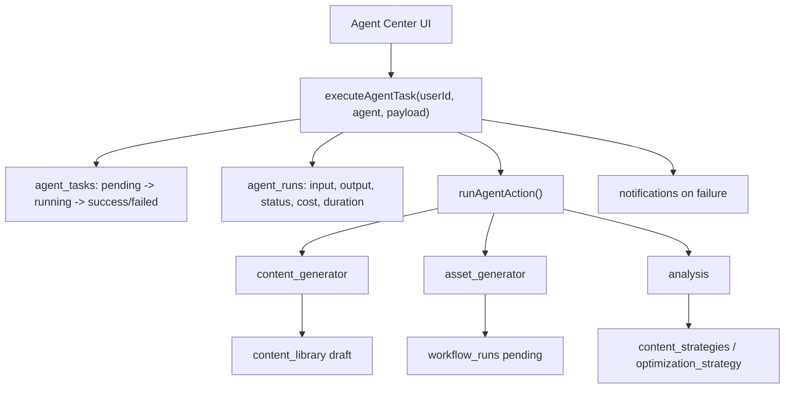
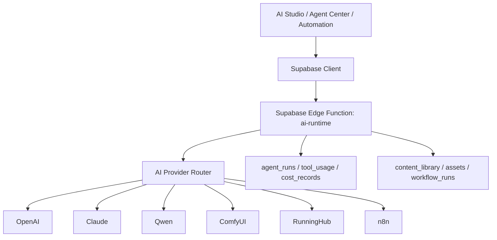

# AI Marketing Studio AI Integration Plan

## 1. Current Positioning

AI Marketing Studio is a **Personal AI Ops Workspace** for one-person content operations.

It is not a SaaS product. AI integration should focus on:

- content intelligence discovery;
- AI analysis;
- content drafting;
- image/video/workflow generation;
- publishing preparation;
- performance feedback;
- strategy optimization.

Do not add Stripe, billing, subscriptions, membership, pricing, or multi-tenant SaaS logic.

## 2. Current Agent Calling Architecture

### Current files

- `src/services/agent-service.js`
- `src/pages/AgentCenter.jsx`
- `src/services/workflow-service.js`
- `src/services/automation-runner.js`
- `src/services/stability-service.js`

### Existing flow



### What already works

- Agent definitions are stored in `agents`.
- Agent executions are stored in `agent_tasks`.
- Runtime logs are stored in `agent_runs`.
- Each run records input, output, status, cost, duration, and error message.
- Three Agent types are already organized:
  - `content_generator`
  - `asset_generator`
  - `analysis`
- Automation can trigger Agent jobs through `automation-runner.js`.
- Failed Agent tasks create notifications.

### Current limitation

The Agent layer currently performs internal deterministic actions only:

- Content Agent creates a draft from local template logic.
- Asset Agent creates a `workflow_run`, but does not call ComfyUI or RunningHub.
- Analysis Agent builds strategy from existing database data, but does not call an LLM.

There is no real AI model call yet.

## 3. Prompt Library Status

### Current files

- `src/services/prompt-service.js`
- `src/pages/PromptLibrary.jsx`
- `src/components/PromptForm.jsx`

### Existing database table

`prompts`

Current supported fields in the UI/service layer:

- `user_id`
- `title`
- `category`
- `content`
- `platform`
- `character`
- `created_at`

### What already works

- Prompt CRUD is connected to Supabase.
- Prompt list supports:
  - search by title/content;
  - category filter;
  - platform filter;
  - character filter.
- Prompt changes create audit logs through `createAuditLog()`.
- Prompts can be selected in Agent Center.
- `content_library` and `workflow_runs` can reference `prompt_id`.

### Current limitation

Prompt Library is currently a storage and selection layer. It does not yet include:

- prompt variable rendering;
- prompt version history;
- provider-specific prompt templates;
- structured output schema;
- prompt testing playground;
- model comparison;
- automatic cost estimation;
- reusable prompt chains.

Recommended next improvement is not to add many features at once, but to add a small `prompt-renderer` utility:

```text
Prompt + Character + Account + Platform + Content Goal
↓
rendered prompt
↓
AI Provider
↓
Agent Run output
```

## 4. Current AI Provider Design

### Current files

- `src/services/ai-service.js`
- `.env.example`
- `src/services/platforms/base-adapter.js`
- `src/services/platforms/platform-adapter.js`

### Existing AI service

`src/services/ai-service.js` currently provides:

- `createMarketingDraft(input)`
- `generateText()`
- `generateImage()`
- `generateVideo()`

Current status:

- `createMarketingDraft()` creates a local draft without external API.
- `generateText()` is reserved for GPT, Claude, Qwen, and n8n.
- `generateImage()` is reserved for Qwen, ComfyUI, and n8n.
- `generateVideo()` is reserved for Qwen, ComfyUI, and n8n.

### Existing provider configuration placeholders

`.env.example` already reserves:

- `OPENAI_API_KEY`
- `ANTHROPIC_API_KEY`
- `QWEN_API_KEY`
- `COMFYUI_BASE_URL`
- `COMFYUI_API_KEY`
- `RUNNINGHUB_BASE_URL`
- `RUNNINGHUB_API_KEY`

### Current gap

There is a clear platform adapter design for social publishing, but there is not yet a matching AI provider adapter layer.

Recommended structure:

```text
src/services/ai/
  ai-provider.js
  openai-provider.js
  anthropic-provider.js
  qwen-provider.js
  comfyui-provider.js
  runninghub-provider.js
  n8n-provider.js
```

Recommended common interface:

```js
generateText({ prompt, systemPrompt, model, temperature, schema, metadata })
generateImage({ prompt, model, size, workflow, referenceAssets, metadata })
generateVideo({ prompt, model, duration, workflow, referenceAssets, metadata })
analyzeContent({ input, prompt, model, schema, metadata })
estimateCost({ provider, model, inputTokens, outputTokens, runtimeSeconds })
```

## 5. API Key Management Status

### Current public frontend keys

The frontend should only use:

- `VITE_SUPABASE_URL`
- `VITE_SUPABASE_ANON_KEY`

This is already consistent with the current GitHub Pages deployment model.

### Current secret handling model

The project already has a good server-side boundary for platform secrets:

- `platform_credentials` stores encrypted provider tokens.
- `platform_credentials` has RLS enabled.
- `anon` and `authenticated` grants are revoked.
- Frontend must not read `platform_credentials`.
- Supabase Edge Functions are the intended place for secret access.

### Recommended AI key handling

AI provider keys must follow the same rule:

```text
Browser / GitHub Pages
  only VITE_SUPABASE_URL + VITE_SUPABASE_ANON_KEY

Supabase Edge Function / n8n / private worker
  OPENAI_API_KEY
  ANTHROPIC_API_KEY
  QWEN_API_KEY
  COMFYUI_API_KEY
  RUNNINGHUB_API_KEY
```

Do not store OpenAI, Claude, Qwen, ComfyUI, or RunningHub keys in frontend code, browser localStorage, GitHub Pages secrets exposed to build output, or normal public tables.

For personal use, the simplest production-safe approach is:

1. Store provider secrets in Supabase Edge Function secrets.
2. Frontend calls one internal Edge Function such as `ai-runtime`.
3. Edge Function calls the selected AI provider.
4. Response is saved into:
   - `agent_runs`
   - `tool_usage`
   - `cost_records`
   - `content_library`
   - `assets`
   - `workflow_runs`

## 6. Functions Waiting for Real API Integration

### Highest priority

| Area | Current status | Needed API |
|---|---|---|
| AI Studio text generation | UI exists, adapter reserved | OpenAI / Claude / Qwen |
| Content Generation Agent | Creates local draft | OpenAI / Claude / Qwen |
| Analysis Agent | Uses local strategy logic | OpenAI / Claude / Qwen |
| Prompt rendering | Prompt selection exists | Internal renderer first, then LLM |
| Tool cost tracking | Tables and services exist | Provider usage metadata |

### Media and workflow generation

| Area | Current status | Needed API |
|---|---|---|
| AI Studio image generation | UI exists, adapter reserved | Qwen image / ComfyUI / RunningHub |
| AI Studio video generation | UI exists, adapter reserved | Qwen video / RunningHub / ComfyUI pipeline |
| Asset Generation Agent | Creates `workflow_runs` only | ComfyUI / RunningHub |
| Workflow Runtime | Saves result when given output | Real runtime execution adapter |
| Asset Library output | Can store generated assets | Runtime output ingestion |

### Automation

| Area | Current status | Needed API |
|---|---|---|
| Automation Agent job | Calls internal Agent service | Real AI provider through Agent |
| Automation Workflow job | Creates/saves simulated workflow result | RunningHub / ComfyUI execution |
| Daily Ops Report | Report concept exists in docs | LLM summary over real metrics |

### Social intelligence and publishing

| Area | Current status | Needed API |
|---|---|---|
| Telegram publishing | Platform function architecture exists | Already first real channel candidate |
| X publishing | Adapter designed, not implemented | X OAuth + write scope |
| YouTube / Instagram / TikTok | Adapter placeholders | Future platform APIs |
| Metrics analysis | Database exists | Platform metrics APIs + LLM strategy |

## 7. Recommended AI Integration Architecture



Recommended request shape:

```json
{
  "task_type": "content_generation",
  "provider": "openai",
  "model": "gpt-4.1-mini",
  "agent_id": "...",
  "prompt_id": "...",
  "character_id": "...",
  "input": {
    "platform": "X",
    "goal": "Create a viral AI character post",
    "audience": "AI creators"
  }
}
```

Recommended response shape:

```json
{
  "success": true,
  "provider": "openai",
  "model": "gpt-4.1-mini",
  "output": {
    "title": "...",
    "content_text": "...",
    "content_type": "text"
  },
  "usage": {
    "input_tokens": 1000,
    "output_tokens": 600,
    "cost": 0.01
  }
}
```

## 8. Recommended Implementation Order

### Phase A: Safe AI runtime foundation

1. Create `supabase/functions/ai-runtime`.
2. Add provider router.
3. Add OpenAI text generation first.
4. Save every call to `agent_runs`, `tool_usage`, and `cost_records`.
5. Do not expose provider keys to frontend.

### Phase B: Prompt-to-Agent connection

1. Add prompt rendering utility.
2. Combine:
   - Agent system prompt;
   - Prompt Library content;
   - Character prompt;
   - Account strategy;
   - Content Intelligence input.
3. Send rendered prompt to `ai-runtime`.
4. Save output as `content_library` draft.

### Phase C: Analysis Agent real LLM upgrade

1. Feed `viral_contents`, `content_analysis`, `content_metrics`, and `campaign_links` into AI runtime.
2. Generate:
   - why it went viral;
   - how to replicate;
   - whether it fits your accounts;
   - next content ideas.
3. Save output into `content_strategies`.

### Phase D: Image and workflow generation

1. Add RunningHub provider adapter.
2. Add ComfyUI provider adapter.
3. Connect `workflow_runs` status:
   - `pending`
   - `running`
   - `success`
   - `failed`
4. Save generated media into `assets`.
5. Create linked content draft.

### Phase E: Daily Ops Report

1. Pull yesterday's intelligence, content, publishing, metrics, and cost data.
2. Ask Analysis Agent for daily recommendations.
3. Save report as a reusable record or markdown export.

## 9. Main Risks

### 1. Frontend key exposure

GitHub Pages is public frontend hosting. Any key used in frontend code or `VITE_*` build variables should be considered public.

Only Supabase public URL and anon/publishable key belong there.

### 2. Treating reserved adapters as completed features

`generateText()`, `generateImage()`, and `generateVideo()` are intentionally placeholders.

The UI should describe them as "not connected yet" until the Edge Function is implemented.

### 3. Cost records without provider usage

`tool_usage` and `cost_records` exist, but real AI cost accuracy requires provider response metadata.

### 4. Prompt quality drift

As more prompts are created, prompt versioning and output evaluation will become important. Do not overbuild it now, but keep the structure open.

### 5. Workflow runtime complexity

RunningHub and ComfyUI may have different job lifecycle models. The safest pattern is to normalize them into `workflow_runs` instead of leaking provider-specific states into UI pages.

## 10. Final Summary

Current project status:

- Agent runtime structure exists.
- Prompt Library exists and is connected to Supabase.
- Workflow runtime data model exists.
- Cost and tool usage tables exist.
- API key safety boundary is mostly correct.
- Social platform adapter pattern exists.

Main missing piece:

- A real AI Provider layer and server-side `ai-runtime` boundary.

Best next action:

Start with one real text provider, preferably OpenAI or Qwen, through Supabase Edge Function. Once text generation is stable, connect Analysis Agent and Content Generation Agent. After that, connect RunningHub or ComfyUI for asset generation.
