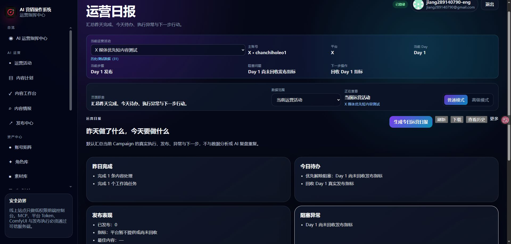
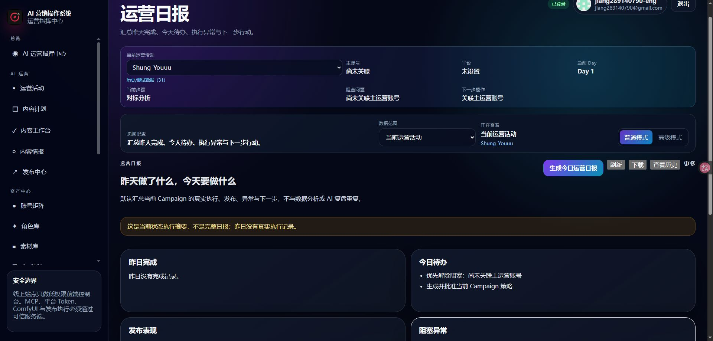
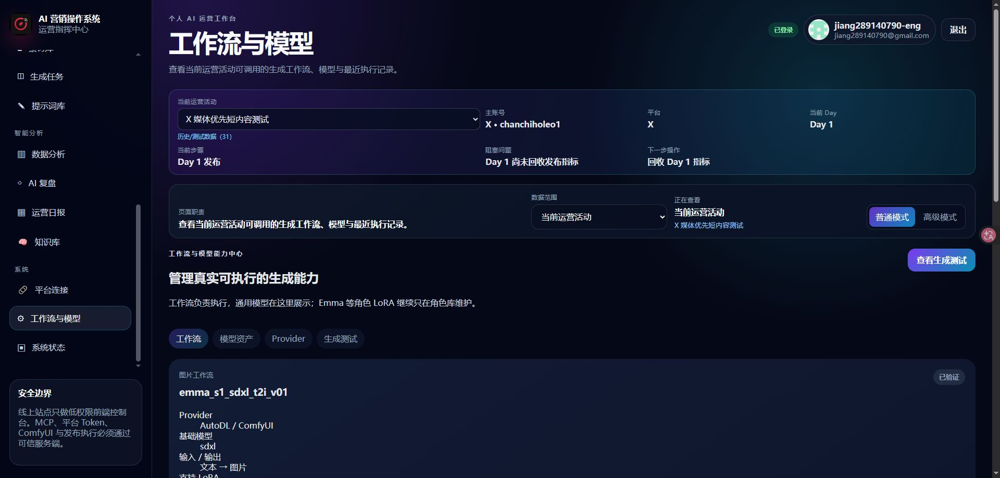

# DAILY_REPORT_AND_ERROR_BOUNDARY_FIX_REPORT

## 结论

运营日报的真实失败已修复，并已部署到登录后的 GitHub Pages 生产页面完成点击验收。

- 有数据：可以生成当前 Campaign 的运营日报。
- 无数据：显示明确空状态，并可生成当前执行摘要。
- 普通模式：不再显示 PostgREST、外键关系、SQL、调用栈或原始 JSON 错误。
- 状态显示：数据库英文值保持不变，页面统一显示中文，`validated` 显示为“已验证”。

## 根因

`publish_tasks` 查询通过 PostgREST 直接嵌入 `campaign_links`：

```text
publish_tasks → campaign_links
```

生产数据库中两者没有直接外键。两张表只能够通过共同的 `content_id` 建立业务关联，因此 PostgREST 无法自动推断关系，返回 schema cache relationship 错误。日报使用 `Promise.all`，任一数据源失败都会中止整个日报；页面又直接显示 `error.message`，最终把底层关系错误暴露给普通用户。

## 修复方式

### 1. 发布任务与 Campaign 链接

- 从 `publish_tasks` 的 PostgREST 嵌入查询中移除不存在的 `campaign_links` 关系。
- 发布任务先读取真实任务和既有合法关系。
- 再按当前用户和 `content_id` 读取 `campaign_links`，在服务层显式关联。
- 没有修改数据库架构、外键、RLS 或数据。

### 2. 运营日报

- 多数据源读取改为可降级汇总：单个非关键数据源失败不再让整页崩溃。
- 全部数据源不可用时才显示结构化业务错误。
- 当前 Campaign 没有昨日活动时，显示原因、前置条件和“生成执行摘要”按钮。
- 有数据时生成昨日完成、今日待办、发布表现、阻塞、Agent 与工作流摘要。
- 日期统一按 `Asia/Shanghai` 计算，避免 UTC 跨日导致昨日数据错位。
- 空字段安全处理，不把缺失指标伪装成 0。

### 3. 统一错误边界

普通模式统一返回：

- 用户说明
- 业务影响
- 推荐操作
- 错误编号
- 是否可重试

高级模式只展示脱敏后的技术详情。Token、Secret、密码、内网地址和长敏感标识会被隐藏。

页面渲染异常也不再直接显示原始异常消息。

### 4. 状态中文化

集中状态表已覆盖：

| 数据库值 | 页面显示 |
| --- | --- |
| validated | 已验证 |
| planned | 已计划 |
| review | 待审核 |
| connected | 已连接 |
| pending | 待处理 |
| completed | 已完成 |
| failed | 失败 |
| not_started | 未开始 |
| dry_run | 安全预演 |
| live | 正式执行 |

同时修复了执行按钮、工作流最近任务、账号关联活动、内容工作台素材状态和平台设置中的英文状态直出。

## 修改文件

- `src/services/publish-service.js`
- `src/services/report-service.js`
- `src/pages/DailyReport.jsx`
- `src/components/BusinessErrorNotice.jsx`
- `src/components/PageErrorBoundary.jsx`
- `src/utils/business-error.js`
- `src/utils/report-time.js`
- `src/utils/formatters.js`
- `src/components/ExecutionButton.jsx`
- `src/hooks/useExecutionAction.js`
- `src/pages/WorkflowModelConfigPage.jsx`
- `src/pages/AccountsPage.jsx`
- `src/pages/ContentWorkspacePage.jsx`
- `src/pages/SettingsPage.jsx`
- `test/daily-report-error-boundary.test.mjs`

## 自动检查

- `npm run typecheck`：PASS
- `npm run lint`：PASS
- `npm test`：PASS，81/81
- `npm run build`：PASS
- GitHub Pages 部署：PASS

## 线上真实验收

线上地址：

<https://jiang289140790-eng.github.io/ai-marketing-studio/>

登录用户：`jiang289140790-eng`

### 有数据路径

1. 打开“运营日报”。
2. 当前 Campaign 为“X 媒体优先短内容测试”。
3. 点击“生成今日运营日报”。
4. 页面成功显示昨日完成、今日待办、发布表现、阻塞异常、Agent 摘要和工作流摘要。
5. 下载按钮可用。
6. 页面文本未出现 PostgREST、schema cache、relationship、foreign key、SQL 或 stack trace。

截图：



### 无数据路径

1. 临时切换到已有且昨日无活动的 Campaign `Shung_Youuu`，没有创建测试数据。
2. 页面显示“尚无已执行任务，无法生成完整日报”及原因。
3. 点击“生成执行摘要”。
4. 成功显示当前状态摘要，并明确提示这不是完整日报。
5. 未显示底层错误。
6. 验收后已恢复当前 Campaign 为“X 媒体优先短内容测试”。

截图：



### 状态中文化

1. 打开“工作流与模型”。
2. 已验证工作流显示“已验证”。
3. 页面扫描未发现本任务要求处理的英文状态值直接显示。

截图：



## 数据库与安全

- 未新增数据库表或字段。
- 未新增 migration。
- 未修改 RLS。
- 未修改 Supabase Secret。
- 未写入测试数据。
- 未触发付费生成或真实发布。

## 提交与部署

- 实现提交：`b7b73dd37ab07c2c9bf6de52162a403e98704047`
- 部署工作流：GitHub Actions `30186714895`
- 部署结果：成功

