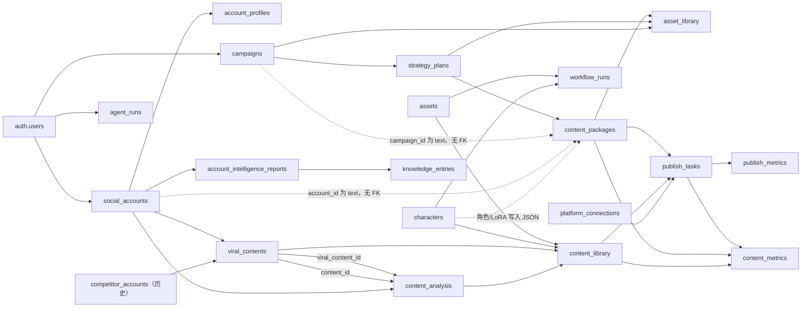

# AI Marketing Studio 最小闭环实施前审计

审计日期：2026-07-25  
审计基线：`1adb890`  
代码分支：`codex/online-fix-task`  
线上网站使用的 Supabase 项目：`qtrlymiqohbjvklwegsw`（`ai-marketing-studio-production-20260719200546`）  
审计方式：代码静态核对、Supabase 只读 SQL、已部署 Edge Function 清单、现有 MCP 工具描述与只读健康检查、构建检查。  

## 0. 审计结论

当前项目已经具备最小闭环的大部分页面、数据库对象和 MCP 动作，不需要重写网站，也不需要为了 Day 1 闭环新增一批平行表。

但现在还不能把整条流程判定为“真实闭环已打通”。优先级最高的阻塞有四个：

1. **网站与 AI Marketing Studio MCP 指向不同数据库。**
   - 网站生产库 `qtrlymiqohbjvklwegsw` 有 `knowledge_entries = 368`。
   - MCP `health_check` 返回 `knowledge_entries_count = 477`。
   - MCP 返回的一条知识记录在网站生产库中不存在，却存在于 `wyvswkxogkmywduhrhkw`（`open-video-studio`，477 条知识记录）。
   - 结论：当前 MCP 实际连接 `open-video-studio`，不是网站生产库。继续通过 MCP 创建 Campaign、策略、内容包或发布任务，会写到错误项目。

2. **生产库中的策略与内容包没有真实关联。**
   - `strategy_plans = 12`，其中 10 条 `approved`。
   - `content_packages = 166`。
   - `content_packages.strategy_plan_id IS NOT NULL = 0`。
   - 所有 166 条内容包都缺少策略外键，无法可靠地从某条策略筛出 Day 1 到 Day 7。

3. **生产库内容包没有持久化 Day 信息。**
   - 带 `day_index` 元数据的内容包为 0。
   - 前端已有 `normalizeContentPackageSequence()` 兜底排序，但在没有 `strategy_plan_id` 的情况下只能按 Campaign/创建时间猜测，不能形成可信的 7 天计划。

4. **发布历史状态存在明显矛盾。**
   - 4 条发布任务是 `status = published`，但 `approval_status = pending`。
   - 1 条任务是 `status = draft`、`approval_status = approved`，同时错误字段写入了 “Preflight and dry-run only”。
   - 这证明测试/预检语义曾与正式状态混用，当前发布数据不能直接作为闭环验收样本。

因此，第一阶段正确做法是：**先统一 MCP 数据库目标，再使用已有字段建立 1 条策略、7 个内容包、只推进 Day 1。**

---

## 1. 当前真实业务流程

### 1.1 代码设计出的流程

```text
账号矩阵 / 对标账号
  → Account Intelligence / Account Brain
  → Campaign
  → Strategy Agent 生成 strategy_plans.daily_plan
  → 人工批准策略
  → MCP 创建内容包
  → 内容工作台按 Day 顺序生产
  → 绑定角色 / LoRA / 参考素材
  → 图片或视频生成
  → 人工确认生成素材
  → 内容终审
  → 创建发布任务
  → 发布前检查（dry-run）
  → 人工批准发布
  → 二次确认后真实发布
  → 指标回收
  → 分析优化
  → Content Memory / Strategy Memory / Knowledge Vault
```

### 1.2 生产数据实际走到的位置

```text
账号、账号画像、Account Brain：已有数据
Campaign：已有数据
策略：已有并有 approved 数据
策略 → 内容包：断开（0 个 content_package 关联 strategy_plan_id）
内容包 → 素材：有 6 个 asset_library 关联内容包
内容包 → 发布任务：只有 1 个 publish_task 关联 content_package
发布任务 → 指标：0 个 content_metrics 关联 publish_task
内容包 → 指标：0 个 content_metrics 关联 content_package
```

当前真实数据更接近“多个历史阶段的功能样本并存”，还不是一条可以追踪 ID 的端到端业务链。

---

## 2. 当前表关系图

实线表示数据库真实外键；虚线表示仅靠文本字段或 JSON 形成的逻辑关系。



需要特别说明：

- `content_packages.strategy_plan_id → strategy_plans.id` 是有效外键，但当前 166 条记录全部为空。
- `content_packages.campaign_id` 和 `account_id` 是 `text`，没有外键。142 条 Campaign 文本值可匹配真实 Campaign，23 条非空值无法匹配；只有 1 条 `account_id` 可匹配 `social_accounts.id`。
- `publish_tasks.campaign_id` 的真实外键目标是历史表 `campaign_links.id`，不是 `campaigns.id`。
- `content_analysis` 同时通过 `viral_content_id` 和 `content_id` 指向 `viral_contents.id`，这正是 PostgREST 嵌套查询歧义的根因。

---

## 3. 当前数据库结构审计

所有下表在生产项目中均启用了 RLS。表中“历史数据”是本次只读查询得到的实际行数。

### 3.1 核心运营对象

| 对象 | 当前用途与关键字段 | 真实关系 | 页面是否使用 | RLS / 历史数据 | 最小闭环判断 / 是否需新增字段 |
|---|---|---|---|---|---|
| `campaigns` | 运营目标层；`name`、`goal`、`target_accounts`、`target_platforms`、`content_themes`、`asset_requirements`、`success_metrics`、`status`、`metadata` | `strategy_plans.campaign_id`、`asset_library.campaign_id` 指向它；内容包仅以 text 逻辑关联 | 指挥中心、运营活动与策略、内容工作台 | RLS；authenticated 仅 own SELECT，写入由 service role；37 条 | 支持 1 Campaign；无需新字段 |
| `strategy_plans` | 策略及日计划；`campaign_id`、`daily_plan`、`target_accounts`、`target_platforms`、`content_themes`、`kpi_targets`、`status`、审批字段、模型消耗字段 | FK 到 Campaign；被内容包、生成素材引用 | 运营活动与策略、内容工作台、指挥中心 | RLS；authenticated own SELECT，写入由 service role；12 条 | 表结构支持；必须统一 `daily_plan` 形状并真正关联内容包；无需新字段 |
| `strategy_plans.daily_plan` | 7 天执行计划 JSON | 由 MCP 生成；前端解析数组或对象 | 策略卡片与 Day Plan | 12 条均非空：1 条为 7 项数组，10 条为 Monday–Sunday 对象，1 条为其他对象 | 可复用；第一阶段应选数组形式的 7 天计划，或在服务层规范化，不需新增字段 |
| `content_packages` | 新版内容生产主对象；正文、Hook、CTA、标签、视觉需求、审核状态 | FK 到 `strategy_plans`，但当前全部为空；被 `asset_library`、`publish_tasks`、`content_metrics` 引用 | 内容工作台、发布队列、指挥中心、运营活动统计 | RLS；authenticated SELECT/UPDATE，INSERT 由 service role；166 条 | 字段足够；必须写入现有 `strategy_plan_id`，Day 信息可放 title/source_insights/image/video JSON；不需新字段 |
| `content_library` | 历史内容/旧版内容生产对象；`content_text`、`asset_id`、`character_id`、`status`、`pipeline_stage`、来源分析字段 | FK 到 assets、characters、viral_contents、content_analysis；被 publish_tasks/content_metrics 引用 | 内容工作台兼容读取、内容情报生成草稿、日报、旧服务 | own CRUD RLS；4 条 | 可保留做历史兼容，不应与 content_packages 同时承担新闭环主对象；无需扩展 |

### 3.2 账号与情报对象

| 对象 | 当前用途与关键字段 | 真实关系 | 页面是否使用 | RLS / 历史数据 | 最小闭环判断 / 是否需新增字段 |
|---|---|---|---|---|---|
| `social_accounts` | 唯一账号实体；`platform`、`account_name`、`username`、`account_role/type/category`、`api_status`、`brain_data`、`character_id` | 被 account_profiles、报告、内容情报、平台连接等引用 | 账号矩阵、内容情报、Campaign、工作台、平台连接 | own CRUD + service role；51 条 | 足够支持 1 自有账号 + 对标账号；无需新字段 |
| `competitor_accounts` | 历史竞品表 | `viral_contents.account_id` 仍可引用 | 当前主页面不再作为主入口 | own CRUD；1 条 | 仅历史兼容；不应重新建设或恢复为主数据源 |
| `account_profiles` | 账号画像与分析摘要；目标受众、内容方向、视觉/文案风格、爆款模式 | FK 到 `social_accounts` | 账号矩阵、情报服务、指挥中心 | own CRUD；32 条 | 支持 Account Brain 的结构化补充；无需新字段 |
| `account_intelligence_reports` | 多模态账号智能报告；样本、互动摘要、Account Brain、建议 | FK 到 social_accounts、knowledge_entries | Campaign 上下文、指挥中心、分析优化 | authenticated 可读取全部，service role 写；12 条 | 支持对标分析；需注意不是 owner-scoped 读取 |
| `viral_contents` | 对标/灵感内容样本 | 同时保留 legacy `account_id` 与 canonical `social_account_id` | 内容情报 | own CRUD；3 条 | 支持最小样本分析；新流程只写 `social_account_id` |
| `content_analysis` | 对单条情报内容的 AI 分析 | 两个 FK 同时指向 viral_contents，并关联 social_accounts | 内容情报 | own CRUD；1 条 | 能支持分析，但嵌套查询当前报错；不需新增字段，只需明确 FK |

`social_accounts` 中按 `account_role → account_type → account_category` 兼容解析后，竞品/灵感账号实际为 44 条；内容情报服务已经采用这一兼容方式。

### 3.3 角色、LoRA、素材和生成

| 对象 | 当前用途与关键字段 | 真实关系 | 页面是否使用 | RLS / 历史数据 | 最小闭环判断 / 是否需新增字段 |
|---|---|---|---|---|---|
| `characters` | 角色脑；外观、性格、Prompt、`lora`、`lora_info`、工作流与参数 | content_library、workflow_runs 引用；content_package 通过 JSON 保存角色/LoRA | 角色库、内容工作台、工作流配置 | own CRUD + service role；2 条，1 条有 LoRA | 足够支持 1 角色 + 1 LoRA；不需要独立 LoRA 表 |
| LoRA 结构 | 没有独立 LoRA 表；使用 `characters.lora` 与 `characters.lora_info` | 内容包将快照写入 image/video requirements | 角色库、内容工作台 | 随 characters 受 RLS 管理 | 第一阶段足够；不要重复建设 LoRA 表 |
| `assets` | 通用素材、Prompt、Workflow 与 LoRA 类型记录；`type`、`url`、`prompt`、`model`、`workflow`、`source` | content_library、workflow_runs、comfy_workflows 引用 | 素材库、AI 成果、工作台、工作流配置 | own CRUD；4 条 | 适合上传素材和工作流定义；无需新表 |
| `asset_library` | 新版生成素材与生成任务合一；输入参考、Prompt、Workflow、任务 ID、输出、状态、发布批准 | FK 到 content_package、strategy、campaign | 工作台、AI 成果、发布队列 | authenticated owner SELECT，service role 写；6 条 | 可同时承担最小闭环的“生成任务 + 生成结果”，无需 `generation_jobs`/`media_assets` 新表 |
| `generation_jobs` | **不存在** | — | 页面以 asset_library、workflow_runs、agent_runs 代替 | — | 第一阶段不需要新增；先复用现有结构 |
| `media_assets` | **不存在** | — | 页面实际使用 assets + asset_library | — | 第一阶段不需要新增 |
| `workflow_runs` | 旧/内部工作流运行状态与输出 | FK 到 assets workflow、characters、prompts | 工作台、AI 成果、系统状态、工作流配置 | own CRUD；0 条 | 可用于技术运行历史，但当前无生产历史 |
| `agent_runs` | Agent 运行、成本、时长和错误 | FK 到 agents、agent_tasks | AI 成果、系统状态、指挥中心 | own CRUD；0 条 | 可做运行审计，但当前没有历史 |

注意：本地存在 `supabase/functions/media-gateway`，但生产项目已部署的 Edge Function 清单中没有 `media-gateway`。当前已部署的是 `platform`、`ops-execute`、`ops-status`、`ops-health`、`ai-gateway`。图片/视频生成目前依赖 MCP Bridge 的工具调用，而不是线上 `media-gateway`。

### 3.4 发布、指标与知识

| 对象 | 当前用途与关键字段 | 真实关系 | 页面是否使用 | RLS / 历史数据 | 最小闭环判断 / 是否需新增字段 |
|---|---|---|---|---|---|
| `publish_tasks` | 发布计划、审批、执行结果、错误与重试 | FK 到 content_library、content_packages、platform_connections；`campaign_id` 错指历史 campaign_links | 发布队列、工作台、系统状态、分析 | own CRUD + service role；5 条 | 字段支持预检/批准/发布，但历史关系和状态需先清理语义；无需新增字段 |
| `publish_metrics` | 每个发布任务的聚合指标 JSON | PK/FK `publish_task_id` | 发布队列、分析、系统状态 | own CRUD；4 条 | 可复用；需在真实发布后写入正确任务 |
| `content_metrics` | 内容级指标快照；曝光、互动、转化、raw_response | FK 到 content_library、content_package、publish_task | Campaign 上下文、分析、日报、系统状态 | own CRUD + service role；6 条 | 字段足够，但当前 0 条关联新版内容包或发布任务 |
| `insights` | 轻量洞察；source、文本、置信度、标签、campaign text | 无强 FK | 指挥中心、分析优化 | authenticated 可读取全部，service role 写；174 条 | 可直接复用；当前非 owner-scoped |
| `knowledge_entries` | Knowledge Vault；类型、正文、embedding、metadata | 报告/研究/机会引用它 | 指挥中心、Campaign 上下文、知识库、分析优化 | authenticated 可读取全部，service role 写；368 条 | 可直接复用；当前非 owner-scoped |
| `content_memory` | 已验证内容模式 | 分析闭环逻辑引用 | 指挥中心、分析 | RLS；有历史数据 | 可直接复用 |
| `strategy_memory` | 策略执行结果和复盘 | Campaign、指挥中心、分析 | RLS；39 条 | 可直接复用 |

---

## 4. 当前页面与真实数据来源

| 页面 | 当前读取 | 当前写入 / 执行动作 | 审计结论 |
|---|---|---|---|
| AI 运营指挥中心 | accounts、profiles、reports、campaigns、strategies、content packages/library、assets、characters、publish/metrics、knowledge/insights/memory、runs、connections | 无直接业务写入 | 总览完整，但会同时展示新旧对象 |
| 运营活动与策略 | campaigns、strategy_plans、social_accounts、account reports、knowledge、strategy memory、content metrics | 网关 `create_campaign`、`generate_strategy`、`approve_strategy`、`reject_strategy`；批准后前端尝试补 Day 元数据 | 设计正确；因 MCP 数据库错位和 0 个策略关联内容包，生产闭环未成立 |
| 内容计划 | 没有独立路由；策略页显示 `daily_plan`，工作台左侧显示 Day Plan | 随策略批准创建内容包 | 不应再新建重复页面；现有两处足够 |
| 内容工作台 | content_packages + content_library、campaigns、strategies、accounts、assets + asset_library、characters、workflow_runs、publish_tasks | 直接保存角色/LoRA/素材绑定与 Context AI 结果；MCP 生成、重生成、素材审核、内容终审 | 功能齐全；必须只以 content_packages 为新闭环主对象 |
| 内容情报 | social_accounts/account_profiles、viral_contents、content_analysis | 保存/删除情报内容；AI 分析；生成旧版 content_library 草稿 | 账号源已统一，但 content_analysis 嵌套关系报错；生成仍落旧内容表 |
| 账号矩阵 | social_accounts、platform_connections | social_accounts CRUD | 是唯一账号主入口，正确 |
| 角色库 | characters | characters CRUD | LoRA 已包含在角色字段中 |
| 素材库 | assets | assets CRUD、Storage 上传 | 管理通用/上传素材；不等于生成素材表 |
| AI 成果 | assets、asset_library、workflow_runs、agent_runs | 只读 | 适合查看生成结果与异常 |
| 发布队列 | publish_tasks、publish_metrics、connections、accounts、content_library/packages、assets/asset_library | MCP 发布预检、批准、真实执行、重试 | 审批设计完整；历史数据状态不可信，需用新的 Day 1 任务验收 |
| 数据分析 / 分析优化 | content_metrics、publish_metrics、publish_tasks、content_memory、strategy_memory | 当前页面只读 | 能展示闭环结果；写入由 MCP 指标/复盘工具完成 |
| 运营日报 | content_library、assets、workflow_runs、viral_contents、publish_tasks、campaign_links、content_metrics、cost/tool usage、notifications、content_strategies | 仅生成/下载本地 JSON | 仍大量依赖历史表，不应作为 Day 1 主链真相来源 |
| 知识库 | knowledge_entries | 当前页面只读 | 写入由 MCP/Agent 完成 |
| 平台连接 | platform_connections、social_accounts、执行网关健康 | 当前页面只读展示 | 生产库有 X connected 1 条、pending 2 条；仅状态记录不能证明真实发布权限 |
| 工作流与模型 | comfy_workflows、characters、assets、asset_library、workflow_runs | 当前页面只读 | 可配置/查看生成依赖；生产 media-gateway 未部署 |
| 系统状态 | agent_runs、workflow_runs、publish_tasks、publish_metrics、content_metrics | 当前页面只读 | 当前 agent/workflow run 均为 0，无法证明真实自动化执行历史 |

主要实现文件：

- `src/App.jsx`
- `src/services/ops-service.js`
- `src/pages/CampaignStrategyPage.jsx`
- `src/pages/ContentWorkspacePage.jsx`
- `src/pages/ContentIntelligence.jsx`
- `src/pages/PublishQueuePage.jsx`
- `src/pages/AnalyticsPage.jsx`
- `src/services/report-service.js`

---

## 5. 当前 MCP 工具清单与能力矩阵

以下为当前可见的 AI Marketing Studio MCP 工具；本审计没有调用任何写工具。

| 目标能力 | 现有工具 | 支持程度 | 备注 |
|---|---|---|---|
| 健康检查 | `health_check` | 有 | 但已证实指向错误 Supabase 项目 |
| 获取账号信息 | `list_website_records`、`get_website_record` | 有 | 可读取 social_account/character 等网站记录 |
| 分析对标账号 | `analyze_account_intelligence` | 有 | 可采集并生成报告 |
| 生成 Account Brain | `analyze_account_intelligence` | 有 | 写 social_accounts/profile/report/knowledge |
| 创建 Campaign | `create_campaign` | 有 | 当前会写入错误项目，修正连接前禁止使用 |
| 读取 Campaign | `get_campaign`、网站记录工具 | 有 | 可包含内容包、洞察、策略记忆 |
| 生成策略 | `generate_content_strategy` | 有 | 可用 Campaign、Account Brain、Knowledge/Memory |
| 批准策略 | `approve_strategy` | 有 | 描述承诺创建 draft content packages |
| 生成 daily_plan | `generate_content_strategy` | 有 | `daily_plan` 形状需要统一为 7 项数组 |
| 创建 content_package | `create_content_package`、`approve_strategy` | 有 | 单条创建工具没有显式 `strategy_plan_id` 参数；批准策略工具应负责关联 |
| 生成文案 | `compose_content` | **部分** | 更接近“组合现有文案与素材”；Context AI 页面可用 `ai-gateway` 生成文案 |
| 创建图片任务 | `generate_character_image`、`run_content_pipeline` | 有 | 使用 asset_library 承载任务/结果 |
| 创建视频任务 | `generate_character_video`、`run_content_pipeline` | 有 | 同上 |
| 查询任务 | `poll_asset_status` | 有 | 更新 asset_library |
| 查询角色/LoRA | 网站记录工具的 `character` 资源、`get_context` | 有 | LoRA 在 character 字段中 |
| 注册/关联素材 | `register_reference_asset`、`compose_content` | 有 | 需版权确认 |
| 审核生成素材 | `review_generated_asset`、`regenerate_asset` | 有 | 不会自动发布 |
| 查询待审核内容 | `list_website_records(content_package/generated_asset)` | 有 | 可按状态过滤 |
| 内容终审入队 | `finalize_content_package` | 有 | 要求已批准最终素材 |
| 创建发布任务 | `create_publish_task` | 有 | 发布仍需二次批准 |
| 运行发布预检 | `execute_publish(dry_run=true)` | 有但无独立工具 | 前端明确以 dry-run 调用 |
| 批准发布 | `approve_publish` | 有 | 人工审批门 |
| 执行发布 | `execute_publish` | 有但强门控 | Bridge 只有在 `ALLOW_REAL_PUBLISH=true`、人工确认且非 dry-run 时才允许真实发布 |
| 回收指标 | `fetch_content_metrics` | **部分** | 描述称当前实现写“安全快照”；不等于所有平台已真实拉取 |
| 生成复盘 | `generate_performance_report` | 有 | 日/周/月 |
| 更新策略记忆 | `update_strategy_from_analytics` | 有 | `auto_apply` 可保持 false |
| 写入知识库 | `save_insight`、`analyze_content`、研究/报告工具 | 有 | 可写 Insight/Knowledge |
| 多模态内容分析 | `analyze_content` | 有 | 图片/视频并可沉淀洞察 |

### 5.1 MCP 与网站环境漂移

这是本审计最严重的问题：

```text
网站生产库 qtrlymiqohbjvklwegsw:
  knowledge_entries = 368

MCP health_check:
  knowledge_entries_count = 477

open-video-studio wyvswkxogkmywduhrhkw:
  knowledge_entries = 477
  MCP 样本记录存在 = true

网站生产库中 MCP 样本记录存在 = false
```

因此，在统一连接前，MCP 的“能力存在”不能等价于“能操作当前线上网站的数据”。

---

## 6. 当前状态清单

### 6.1 数据库允许状态与实际状态

| 对象 | 数据库允许值 | 生产库实际值 |
|---|---|---|
| Campaign | `draft / active / paused / completed / archived` | `draft: 35`，`active: 2` |
| Strategy | `draft / review / approved / active / completed / archived` | `review: 2`，`approved: 10` |
| Content Package `review_status` | `draft / review / approved / rejected / scheduled / published` | `draft: 157`，`review: 8`，`approved: 1` |
| Content Package `status` | **没有 CHECK 约束**，默认 `draft` | 与 review_status 当前完全相同 |
| Content Library `status` | `idea / researching / draft / generating / review / scheduled / published / analyzing / archived / failed` | `scheduled: 4` |
| Content Library `pipeline_stage` | 没有 CHECK 约束 | `draft: 2`，`scheduled: 2` |
| Generation Job | 独立表不存在 | 使用 asset_library / workflow_runs / agent_runs |
| Generated Media Asset (`asset_library`) | `pending / generating / completed / failed / archived` | `pending: 5`，`completed: 1` |
| Generic Asset (`assets`) | 无 status 字段 | 4 条 |
| Publish Task `status` | `draft / scheduled / publishing / published / failed` | `draft: 1`，`published: 4` |
| Publish Task `approval_status` | 无 CHECK，默认 `pending` | `pending: 4`，`approved: 1` |
| Agent Run | `pending / running / success / failed` | 0 条 |
| Workflow Run | `pending / running / success / failed` | 0 条 |

### 6.2 状态问题

1. **重复含义**
   - `content_packages.status` 与 `review_status` 重复；当前数据虽一致，但代码会在两者间兜底。
   - `content_library.status` 与 `pipeline_stage` 重复，且实际已有 2 条不一致。
   - `publish_tasks.status` 与 `approval_status` 是不同维度，但页面容易把它们混成一个“已批准/已发布”状态。

2. **测试与正式状态混用**
   - 4 条 `published + pending approval` 不符合正式审批流程。
   - 1 条 `draft + approved` 的错误字段写着 “Public Bridge acceptance test. Preflight and dry-run only.”。

3. **approved 但无法执行**
   - 10 条 approved strategy 对应 0 个带 strategy_plan_id 的内容包。
   - 1 条 approved content package 不代表它已经具备已批准素材、发布连接和发布任务。

4. **dry-run 被显示为失败**
   - 现有验收任务把 “Preflight and dry-run only” 写入错误字段，因此页面会按失败原因展示。
   - 预检结果应保存在 result/publish_result 的模式字段中，不应写 error_message/last_error。

5. **中文状态与数据库状态**
   - `src/utils/formatters.js` 已覆盖大多数状态中文。
   - `ready_for_review`、`ready_for_publish`、`generated`、`cancelled` 等服务层状态没有统一数据库约束和全局中文映射，部分页面自行解释。

---

## 7. 内容情报嵌套关系错误定位

错误：

```text
Could not embed because more than one relationship was found for
'content_analysis' and 'viral_contents'
```

根因已经由数据库约束和代码共同确认：

- `content_analysis.viral_content_id → viral_contents.id`
- `content_analysis.content_id → viral_contents.id`
- `src/services/intelligence-service.js` 的 `analysisSelect` 使用：

```js
viral_contents(...)
```

PostgREST 无法判断应该使用哪一个外键，所以拒绝嵌套。

未来修复时应明确关系，例如选择 canonical 字段：

```js
viral_contents!content_analysis_viral_content_id_fkey(...)
```

或明确选择 `content_id` 的约束。第一阶段建议统一使用 `viral_content_id`，`content_id` 只做历史兼容。

本次审计没有修改该代码或数据库。

---

## 8. 最小闭环逐步能力检查

| 步骤 | 已有能力 | 缺失 / 阻塞 |
|---|---|---|
| 1. 对标账号分析 | social_accounts、account_profiles、reports、Account Brain、MCP 分析工具 | MCP 指向错误库；内容分析嵌套报错 |
| 2. 创建/选择 Campaign | 表、页面、MCP create/get 均有 | MCP 错库；应只选 1 个 Campaign |
| 3. 生成并批准策略 | Strategy Agent、审批工具、页面均有 | 生产 approved 策略没有关联内容包 |
| 4. 生成 7 天计划 | daily_plan 字段、前端兼容解析均有 | 历史 JSON 形状不一致；只有 1 条明确 7 项数组 |
| 5. 创建 Day 1 content_package | approve_strategy/create_content_package 可创建；现有 strategy_plan_id 字段 | 当前生产 166 条全部未关联策略，Day 元数据为 0 |
| 6. 生成文案 | Context AI + ai-gateway；compose_content | MCP 文案工具更偏组合；需要确保写回同一 Day 1 |
| 7. 绑定角色/LoRA | characters.lora/lora_info、工作台绑定 JSON | 需选定唯一角色并保存快照 |
| 8. 生成/选择素材 | assets、asset_library、图片/视频 MCP | 生产 media-gateway 未部署；MCP 错库；只应先完成一种素材 |
| 9. 人工审核 | 素材审核、内容终审按钮和工具均有 | 需明确素材批准与内容批准两个状态 |
| 10. 发布预检 | 页面检查清单 + execute_publish dry-run | 历史 dry-run 被错误标记失败 |
| 11. 正式发布 | approve_publish + execute_publish + 人工二次确认 | 未验证 Bridge 真实发布开关和目标平台权限；不得用旧任务验收 |
| 12. 指标回收 | publish/content metrics 表与 MCP 工具 | 当前 0 条指标关联新版内容包/发布任务；工具描述仅保证安全快照 |
| 13. 分析优化 | 分析页、performance report、strategy update 工具 | 需先有真实 Day 1 指标 |
| 14. 知识沉淀 | insights、knowledge、content/strategy memory | MCP 错库，当前沉淀可能进入另一个项目 |

---

## 9. 可以直接复用的结构

1. `campaigns` 作为唯一运营目标层。
2. `strategy_plans.daily_plan` 作为 7 天计划来源。
3. `content_packages.strategy_plan_id` 作为策略到内容包的真实关联。
4. `content_packages.source_insights/image_requirements/video_requirements` 保存 Day、角色、LoRA、参考素材和生成参数快照。
5. `normalizeContentPackageSequence()` 作为 Day 排序与当前步骤解析器。
6. `social_accounts` 作为 owned/competitor/inspiration 唯一账号实体。
7. `characters.lora/lora_info` 作为 LoRA 配置，不再建 LoRA 平行表。
8. `assets` 管理上传/通用素材，`asset_library` 管理生成任务与生成结果。
9. `publish_tasks` 的审批门 + dry-run + 二次确认机制。
10. `content_metrics`、`publish_metrics`、`content_memory`、`strategy_memory`、`knowledge_entries` 完成学习闭环。
11. 现有安全执行链：浏览器 → Supabase Edge Function → MCP Bridge → MCP。

---

## 10. 必须修改的部分

以下是后续实施任务，不在本次审计中执行：

1. **统一 MCP 数据库**
   - 把 AI Marketing Studio MCP 从 `wyvswkxogkmywduhrhkw` 切换到网站生产项目 `qtrlymiqohbjvklwegsw`。
   - 切换后先运行只读 health/list/get 验证，不立即写入。

2. **建立策略到内容包的真实关联**
   - `approve_strategy` 创建的每个内容包必须写 `strategy_plan_id`。
   - `campaign_id` 必须写真实 Campaign UUID 文本。
   - 7 个包分别保存 Day 1–7 元数据。

3. **统一 daily_plan 输入形状**
   - 新最小闭环固定使用 7 项数组。
   - 历史 Monday–Sunday 对象继续由前端兼容，不批量迁移。

4. **让 Day 1 成为唯一验收对象**
   - 只生成/审核/发布 Day 1。
   - Day 2–7 保持 draft，不触发素材和发布。

5. **修复 content_analysis 嵌套查询**
   - 在 select 中显式指定 FK，不新增字段。

6. **修正发布状态写入语义**
   - dry-run 成功不能写 error 字段。
   - `published` 必须要求 `approval_status = approved` 且存在真实发布结果。

7. **让指标关联新链路**
   - 新的 Day 1 指标同时写入 `publish_task_id` 和 `content_package_id`。

---

## 11. 不应重复建设的部分

1. 不要重新启用 `competitor_accounts` 作为内容情报账号主入口。
2. 不要新建第二套 Campaign/Strategy/Content Package 表。
3. 不要为第一阶段新建 LoRA 表。
4. 不要为第一阶段新建 `generation_jobs` 或 `media_assets`；先复用 `asset_library`。
5. 不要再建一个独立“内容计划”页面；策略页预览 + 工作台 Day Plan 已足够。
6. 不要让 content_library 与 content_packages 同时成为新流程主对象。
7. 不要在前端保存 MCP Token、平台 Token、service role key 或模型 Secret。
8. 不要绕过发布审批门直接调用平台 API。

---

## 12. 建议实施顺序、文件、风险与回滚

| 顺序 | 任务 | 涉及文件/配置 | 主要风险 | 回滚方式 |
|---|---|---|---|---|
| 0 | 对齐 MCP 到生产项目并做只读验证 | MCP 服务端环境配置、`services/mcp-runtime-bridge/*`、生产部署配置 | 写错库、旧 MCP 数据不可见 | 恢复旧环境变量；切换期间禁用写动作 |
| 1 | 选定 1 Campaign、1 owned account、1 platform、1 character | 不需改代码；只使用现有业务记录 | 选择历史测试对象造成混淆 | 只记录所选 ID，不修改其他对象 |
| 2 | 统一策略输出为 7 项 daily_plan | MCP 策略实现；`src/pages/CampaignStrategyPage.jsx` 的规范化输入 | 旧对象结构被误写 | 只对新策略生效；旧策略保持只读 |
| 3 | 修复批准策略创建 7 个关联内容包 | MCP `approve_strategy` 实现、Bridge action registry、`src/services/ops-service.js` | 重复创建内容包 | 使用幂等键；按 strategy_id 查询后再创建；失败时删除本次新建的 7 个草稿 |
| 4 | 验证 Day 1 工作台 | `src/utils/content-package-sequence.js`、`src/pages/ContentWorkspacePage.jsx` | 误选历史未关联内容包 | URL 强制 `strategy_id` + `day=1`；回滚为只读列表 |
| 5 | 文案、角色/LoRA、素材绑定 | `src/pages/ContentWorkspacePage.jsx`、`src/services/ops-service.js`、Context AI 服务 | JSON 快照覆盖旧字段 | 更新前保存原 JSON；仅合并键，不整段覆盖 |
| 6 | 图片或视频生成与素材审核 | MCP generation/review 工具、`asset_library`、Bridge | 远程费用、重复任务 | 先 dry-run/单任务；使用 generation_task_id；失败归档新资产 |
| 7 | 内容终审和发布任务 | MCP finalize/create publish；`src/pages/PublishQueuePage.jsx` | 未批准内容进入发布队列 | 保留人工终审；删除/作废本次 draft publish task |
| 8 | 预检、批准、真实发布 | `execute_publish`、`approve_publish`、Bridge 发布配置、平台 Edge Function | 对外发布不可逆 | 先 dry-run；真实发布前二次确认；必要时平台端删除/撤回 |
| 9 | 指标回收与分析沉淀 | MCP metrics/report/update tools；`content_metrics`、`publish_metrics`、knowledge/memory | 指标关联错内容 | 以 publish_task_id + content_package_id 双重校验；删除错误快照后重拉 |
| 10 | 修复内容情报 FK 歧义和状态展示 | `src/services/intelligence-service.js`、`src/utils/formatters.js`、发布结果写入逻辑 | 旧查询兼容性 | 单文件回退；保留旧字段读取兜底 |
| 11 | 添加自动化测试与 typecheck | `package.json`、测试目录、可选 JS 类型检查配置 | 构建链变严格后暴露历史问题 | 先作为非阻断检查，再逐步设为 CI 必须项 |

第一阶段不需要 migration；如果未来要从根本上修复 `content_packages.campaign_id/account_id` 类型和 `publish_tasks.campaign_id` 错误外键，那是独立的数据迁移项目，不应夹在 Day 1 最小闭环里执行。

---

## 13. 验收标准

只有同时满足以下条件，才能宣布 Day 1 最小闭环完成：

1. MCP health/list/get 与网站读取到同一个 Supabase 项目和同一条 Campaign。
2. 1 条 approved strategy 有 7 个 content_packages。
3. 7 个包的 `strategy_plan_id` 均等于该策略 ID。
4. 工作台默认选中 Day 1。
5. Day 1 有明确的文案、角色 ID、LoRA 快照和参考素材。
6. 至少 1 个 `asset_library` 结果为 completed 且人工批准。
7. Day 1 内容终审后创建 1 条 publish_task。
8. dry-run 成功，不产生 failed/error 状态。
9. publish_task 经人工批准后才允许真实执行。
10. 真实发布结果包含平台帖子 ID/URL。
11. content_metrics 同时关联 Day 1 content_package 与 publish_task。
12. 分析报告、策略记忆或知识记录能回查到同一 Campaign/Content Package。

---

## 14. 检查结果

### 14.1 `npm run typecheck`

**未通过：项目没有 `typecheck` script。**

```text
npm error Missing script: "typecheck"
```

这不是 TypeScript 类型错误结论，而是当前工程没有配置该检查。项目主体是 JavaScript/JSX。

### 14.2 `npm run build`

**通过。**

- Vite 8.1.5
- 127 modules transformed
- 构建耗时约 636 ms
- 最大入口 chunk：约 415.34 kB，gzip 119.37 kB
- 内容工作台独立 chunk：约 58.22 kB，gzip 15.54 kB

### 14.3 现有相关测试

项目中没有发现 `test/spec/__tests__` 测试文件，`package.json` 也没有 `test` script，因此没有可运行的现有自动化测试。

作为现有相关质量检查，补充运行：

- `npm run lint`：**通过**
- `npm run migrations:check`：**通过**
  - 29 个 migration 文件
  - 未发现不安全的重复 policy/table/index 创建
  - Overall status: safe

---

## 15. 本次审计边界

本次只新增本报告，没有：

- 新建或执行 migration；
- 修改页面或服务代码；
- 修改 Supabase 配置、RLS、Secrets；
- 修改 MCP 工具或 Bridge；
- 写入测试数据；
- 创建 Campaign、策略、内容包、素材或发布任务；
- 执行发布；
- 部署网站或服务。

