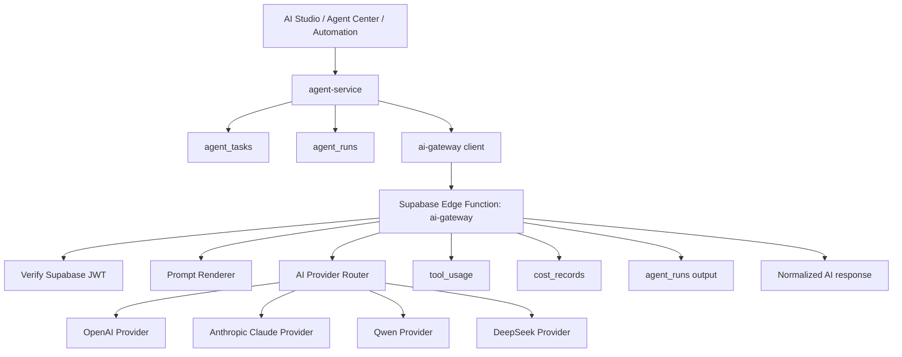
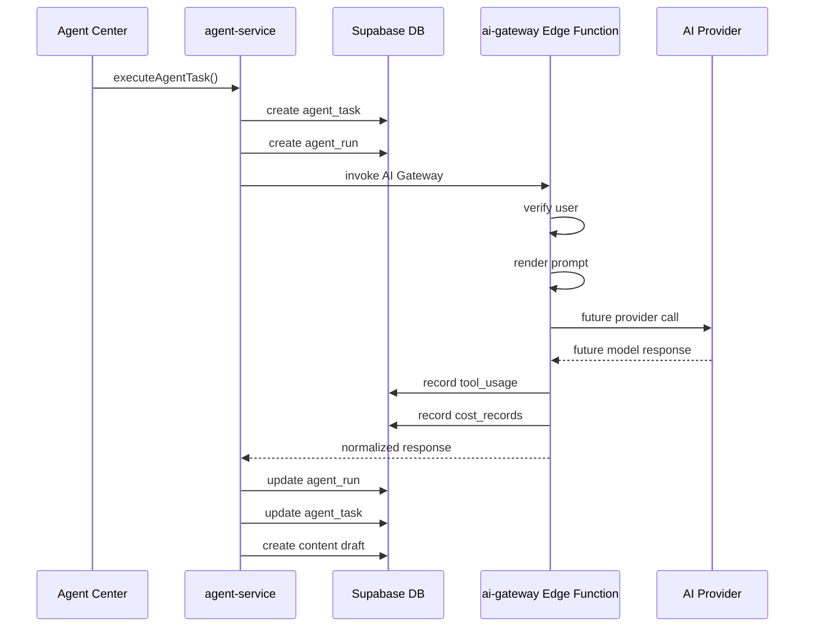

# AI Gateway Design

## 1. Phase 3.1 Goal

Build a unified **AI Integration Layer** for AI Marketing Studio.

The system must not hardcode model APIs inside Agent logic. Agents should describe what they need; AI Gateway should decide how to call the selected provider safely.

Project positioning remains:

- Personal AI Ops Workspace
- personal account operations
- personal content production
- personal cost monitoring

Do not add:

- Stripe
- Billing
- Subscription
- Membership
- Pricing
- multi-tenant SaaS logic

## 2. Supported Provider Scope

Phase 3.1 designs the provider layer for:

- OpenAI
- Anthropic Claude
- Qwen
- DeepSeek

This phase does **not** call real provider APIs yet.

The goal is to define the architecture, request shape, response shape, database relationship, and security boundary before implementation.

## 3. Current System Context

### Existing Agent layer

Current runtime files:

- `src/services/agent-service.js`
- `src/pages/AgentCenter.jsx`
- `src/services/automation-runner.js`

Current tables:

- `agents`
- `agent_tasks`
- `agent_runs`

Current Agent types:

- `content_generator`
- `asset_generator`
- `analysis`

Current behavior:

- Content Agent creates a local draft.
- Asset Agent creates a `workflow_run`.
- Analysis Agent reads existing operational data and creates a strategy.

Current limitation:

- No real AI provider is called.
- Model selection is stored on `agents.model`, but there is no provider router.
- Agent logic currently owns too much generation behavior.

### Existing Prompt Library

Current files:

- `src/services/prompt-service.js`
- `src/pages/PromptLibrary.jsx`
- `src/components/PromptForm.jsx`

Current table:

- `prompts`

Current behavior:

- Prompt CRUD is connected to Supabase.
- Prompts can be filtered by category, platform, character, and search keyword.
- Prompts can be linked to Agent task payloads through `prompt_id`.

Current limitation:

- Prompt rendering is not centralized.
- Prompt variables are not standardized.
- Provider-specific prompt formatting does not exist yet.

### Existing cost and usage tables

Current tables:

- `tool_usage`
- `cost_records`

Current behavior:

- Costs can already be recorded for personal operations.
- Tool usage can link to content and Agent runs.

Current limitation:

- No provider usage metadata is captured yet because no real AI provider is called.

## 4. Proposed Architecture



## 5. AI Gateway Responsibility

AI Gateway should be the single boundary for model execution.

It should handle:

- provider selection;
- model selection;
- prompt rendering;
- secret access;
- request normalization;
- response normalization;
- usage tracking;
- cost tracking;
- duration tracking;
- error normalization;
- safe output return to frontend/Agent layer.

It should not handle:

- page UI state;
- social publishing;
- workflow asset storage;
- business-specific Agent branching;
- billing or subscription.

## 6. Recommended File Structure

### Frontend service layer

```text
src/services/ai-gateway-service.js
```

Purpose:

- expose one frontend-safe function: `invokeAIGateway()`;
- call Supabase Edge Function;
- never import provider SDKs;
- never access AI provider keys.

Suggested frontend function:

```js
invokeAIGateway({
  agent,
  task,
  prompt,
  modelPreference,
  context,
})
```

### Edge Function layer

```text
supabase/functions/ai-gateway/
  index.ts
  providers/
    openai.ts
    anthropic.ts
    qwen.ts
    deepseek.ts
  prompt-renderer.ts
  cost-estimator.ts
  response-normalizer.ts
```

Purpose:

- read AI secrets from Supabase Edge Function environment;
- call actual AI providers later;
- write usage/cost records with service role;
- return safe normalized results.

## 7. Unified AI Gateway Input

Recommended request shape:

```json
{
  "agent": {
    "id": "agent uuid",
    "name": "Content Generation Agent",
    "type": "content_generator",
    "model": "gpt-4.1-mini",
    "system_prompt": "You are a content operations assistant."
  },
  "task": {
    "id": "agent task uuid",
    "task_type": "content_generation",
    "input_data": {
      "platform": "X",
      "goal": "Create an AI character marketing post",
      "account_category": "brand"
    }
  },
  "prompt": {
    "id": "prompt uuid",
    "title": "Viral X post prompt",
    "category": "content_generation",
    "content": "Write a post for {{platform}} about {{goal}}."
  },
  "modelPreference": {
    "provider": "openai",
    "model": "gpt-4.1-mini",
    "temperature": 0.7,
    "response_format": "json"
  },
  "context": {
    "character": {},
    "account": {},
    "assets": [],
    "intelligence": [],
    "metrics": []
  }
}
```

## 8. Unified AI Gateway Output

Recommended response shape:

```json
{
  "success": true,
  "provider": "openai",
  "model": "gpt-4.1-mini",
  "response": {
    "title": "Example content title",
    "content_text": "Generated content body",
    "content_type": "text",
    "metadata": {}
  },
  "usage": {
    "input_tokens": 1200,
    "output_tokens": 600,
    "total_tokens": 1800
  },
  "cost": {
    "currency": "USD",
    "amount": 0.01,
    "estimated": true
  },
  "duration": {
    "ms": 2300
  },
  "error": null
}
```

Failure shape:

```json
{
  "success": false,
  "provider": "openai",
  "model": "gpt-4.1-mini",
  "response": null,
  "usage": null,
  "cost": {
    "currency": "USD",
    "amount": 0,
    "estimated": true
  },
  "duration": {
    "ms": 900
  },
  "error": {
    "code": "provider_not_configured",
    "message": "OpenAI key is not configured in Supabase Edge Function Secrets."
  }
}
```

## 9. Provider Selection Rules

Recommended selection order:

1. If task explicitly passes `modelPreference.provider`, use it.
2. Else infer provider from `agents.model`.
3. Else use workspace default from Edge Function config.
4. Else fail with `provider_not_configured`.

Suggested model mapping:

| Provider | Example model preference | Best initial use |
|---|---|---|
| OpenAI | `gpt-4.1-mini`, `gpt-4.1` | content generation, structured output |
| Anthropic Claude | `claude-sonnet-*` | long analysis, strategy writing |
| Qwen | `qwen-plus`, image/video variants later | Chinese/English mixed content, Alibaba ecosystem |
| DeepSeek | `deepseek-chat`, `deepseek-reasoner` | lower-cost analysis and reasoning |

No provider should be considered active until its Edge Function secret is configured and a smoke test passes.

## 10. Database Relationship Design

No schema change is required in Phase 3.1 because existing tables can already support the first AI Gateway design.

### Existing tables used

#### `agents`

Used for:

- Agent name;
- Agent type;
- preferred model;
- system prompt;
- status.

Recommended usage:

- `agents.model` may store either a simple model name or provider-prefixed value.

Examples:

```text
openai:gpt-4.1-mini
anthropic:claude-sonnet-4
qwen:qwen-plus
deepseek:deepseek-chat
```

#### `agent_tasks`

Used for:

- task type;
- input data;
- status;
- result;
- retry fields.

Recommended usage:

- store the original task input;
- store final normalized result after AI Gateway returns.

#### `agent_runs`

Used for:

- runtime input;
- runtime output;
- status;
- cost;
- duration;
- error message.

Recommended usage:

- `input` should include AI Gateway request summary, not raw secrets;
- `output` should include normalized response;
- `cost` should store final provider cost;
- `duration` should store total AI Gateway duration.

#### `prompts`

Used for:

- reusable prompt templates;
- platform/category/character filtering.

Recommended usage:

- prompt content should become part of the rendered prompt;
- keep raw prompt template separate from rendered prompt.

#### `tool_usage`

Used for:

- provider usage history;
- personal AI operations cost analysis.

Recommended record:

```json
{
  "tool_name": "ai-gateway",
  "provider": "openai",
  "usage_type": "text_generation",
  "units": 1800,
  "unit_cost": 0.000005,
  "total_cost": 0.009,
  "related_agent_run_id": "agent run uuid",
  "metadata": {
    "model": "gpt-4.1-mini",
    "input_tokens": 1200,
    "output_tokens": 600
  }
}
```

#### `cost_records`

Used for:

- daily personal AI cost;
- workflow cost;
- API cost.

Recommended record:

```json
{
  "category": "ai",
  "source": "openai:gpt-4.1-mini",
  "amount": 0.009,
  "metadata": {
    "agent_run_id": "agent run uuid",
    "agent_task_id": "agent task uuid"
  }
}
```

## 11. Prompt Rendering Design

AI Gateway should render prompts before calling providers.

Recommended rendering context:

```json
{
  "agent": {},
  "task": {},
  "prompt": {},
  "character": {},
  "account": {},
  "assets": [],
  "intelligence": [],
  "metrics": []
}
```

Recommended final prompt object:

```json
{
  "system": "Agent system prompt",
  "user": "Rendered prompt content",
  "metadata": {
    "prompt_id": "uuid",
    "character_id": "uuid",
    "account_id": "uuid",
    "platform": "X"
  }
}
```

Rules:

- Prompt templates can use variables like `{{platform}}`, `{{goal}}`, `{{audience}}`.
- Missing variables should not crash by default; they should remain visible or be replaced with an empty string depending on template strictness.
- Rendered prompt should be logged in `agent_runs.input` only if it does not contain secrets.
- Provider API keys must never appear in prompt logs.

## 12. Supabase Edge Function Security Strategy

### Secrets location

AI keys must exist only in Supabase Edge Function Secrets:

```text
OPENAI_API_KEY
ANTHROPIC_API_KEY
QWEN_API_KEY
DEEPSEEK_API_KEY
```

Optional provider base URLs:

```text
OPENAI_BASE_URL
ANTHROPIC_BASE_URL
QWEN_BASE_URL
DEEPSEEK_BASE_URL
```

### Frontend forbidden values

Do not expose these in:

- `VITE_*` variables;
- GitHub Pages build output;
- browser localStorage;
- normal public tables;
- client-side JavaScript;
- screenshots or reports.

### Request authorization

AI Gateway Edge Function should:

1. Read the caller JWT from `Authorization: Bearer <token>`.
2. Verify the user with Supabase Auth.
3. Require a valid `user_id`.
4. Only read/write rows belonging to that user.
5. Use service role only inside the Edge Function.
6. Return only safe normalized data.

### Data isolation

Even though this is personal software, keep RLS and user ownership intact:

- safer future migration;
- fewer accidental leaks;
- cleaner debugging;
- consistent Supabase pattern.

## 13. Calling Flow

### Content Generation Agent



### Analysis Agent

```text
viral_contents + content_analysis + content_metrics + campaign_links
↓
prompt renderer
↓
AI Gateway
↓
optimization strategy
↓
content_strategies
↓
agent_runs + tool_usage + cost_records
```

### Asset Generation Agent

For Phase 3.1, Asset Agent should remain unchanged.

Later, it can use the same Gateway pattern or a dedicated Workflow Gateway:

```text
Agent
↓
workflow_runs
↓
ComfyUI / RunningHub runtime
↓
assets
↓
content_library draft
```

## 14. Error Handling Strategy

Recommended normalized error codes:

| Code | Meaning |
|---|---|
| `provider_not_configured` | Missing provider key or base URL |
| `model_not_supported` | Selected model is not available for provider |
| `prompt_render_failed` | Prompt variables or format failed |
| `provider_request_failed` | Provider API returned an error |
| `provider_timeout` | Provider request timed out |
| `invalid_gateway_request` | Missing agent/task/prompt input |
| `unauthorized` | Missing or invalid Supabase session |

Agent layer should map failures to:

- `agent_runs.status = failed`
- `agent_runs.error_message`
- `agent_tasks.status = failed`
- `agent_tasks.last_error`
- `notifications`

## 15. Cost Calculation Strategy

Phase 3.1 should design cost tracking but not require exact pricing.

Recommended fields from providers:

- input tokens;
- output tokens;
- total tokens;
- model name;
- provider name;
- request duration;
- generated media count, if applicable later.

If exact cost is unavailable:

- mark `estimated: true`;
- record units and provider metadata;
- keep amount as `0` or configured estimate.

Cost should be written to:

- `agent_runs.cost`
- `tool_usage.total_cost`
- `cost_records.amount`

## 16. Integration Boundary with Existing Business Logic

Do not rewrite existing business modules in Phase 3.1.

Allowed next code additions:

- AI Gateway design document;
- future `ai-gateway-service.js`;
- future `supabase/functions/ai-gateway`;
- future provider placeholder adapters.

Not allowed in Phase 3.1:

- hardcoding OpenAI/Claude/Qwen/DeepSeek calls in `agent-service.js`;
- putting API keys in frontend;
- changing existing table schema without a separate migration plan;
- replacing current Agent workflows;
- adding SaaS billing features.

## 17. Recommended Phase 3.2 Implementation Plan

When ready to implement, do it in this order:

1. Add `DEEPSEEK_API_KEY` to `.env.example` as an Edge Function secret only.
2. Create `src/services/ai-gateway-service.js`.
3. Create `supabase/functions/ai-gateway/index.ts`.
4. Add provider placeholder modules for OpenAI, Anthropic, Qwen, DeepSeek.
5. Add request validation and auth check.
6. Return `provider_not_configured` unless a provider is explicitly configured.
7. Update Agent execution to call AI Gateway behind a feature flag.
8. Keep fallback local draft behavior until real provider smoke test passes.
9. Record usage into `agent_runs`, `tool_usage`, and `cost_records`.
10. Only then connect the first real provider.

## 18. Phase 3.1 Final Decision

AI Marketing Studio should use:

```text
Agent / Prompt / Task
↓
AI Gateway Client
↓
Supabase Edge Function
↓
Provider Router
↓
OpenAI / Claude / Qwen / DeepSeek
↓
Normalized response
↓
agent_runs / tool_usage / cost_records / content_library
```

This keeps the system clean, secure, and easy to expand without scattering provider-specific code across the app.
