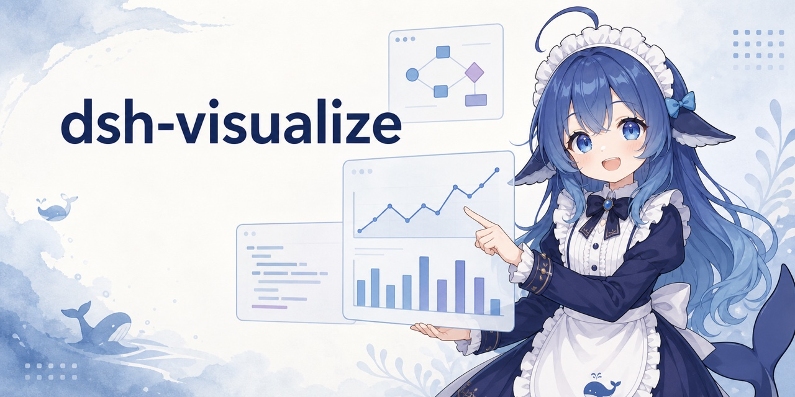
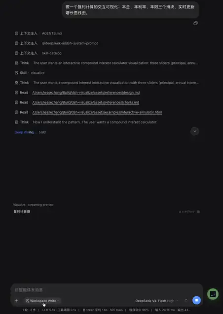

# dsh-visualize



<p align="center">
  <a href="README.md">简体中文</a> | <strong>English</strong>
</p>

DSH does not have to answer with text alone. When the model calls `visualize`, the Web UI renders an interactive card inside the conversation for simulators, charts, comparison panels, and UI mockups.

<div align="center">

[](assets/demo.mp4)

</div>

## Install

Install the plugin from GitHub into DSH's `web` profile:

```sh
dsh plugin --profile web add github:Nagi-ovo/dsh-visualize
# If dsh web is running, restart it and refresh the page.
```

Run `dsh --profile web --dump-config` to confirm that the plugin is present in the final configuration. For local development, clone the repository and run `dsh plugin --profile web add .` from its root; committed build output means no separate build step is required. Users of the community [plugin-registry](https://github.com/dsh-external/plugin-registry) can also install it from Settings → Plugins.

## Use it

Tell the model what you want to explore, for example, “make an adjustable visualization of a sorting algorithm.” The model writes an HTML fragment, then calls `visualize(path, title?, mode?)` to place it in the conversation. Side-by-side comparisons can use `mode: "wide"`.

Cards follow the DSH light or dark theme and whale-blue palette. Session replay restores them from the persistent tool result, so the original fragment file does not need to remain on disk.

## Security

Each card runs in a sandboxed iframe with an opaque origin and cannot access the host page. Its CSP blocks network requests, nested pages, and form submissions, while allowing static assets from a fixed set of CDNs. Fragments are limited to `1000000` bytes by default; change `maxFragmentBytes` to use a different limit.

## Limitations

Interactive cards currently render only in the Web UI. TUI and headless clients show the standard tool result instead. Buttons inside a card cannot yet send follow-up messages to the conversation.

Inspired by `/visualize` in the Codex desktop app. The layered skill references and Chart.js-first approach draw from [himself65/finance-skills](https://github.com/himself65/finance-skills/tree/main/plugins/ui-tools/skills/generative-ui).
